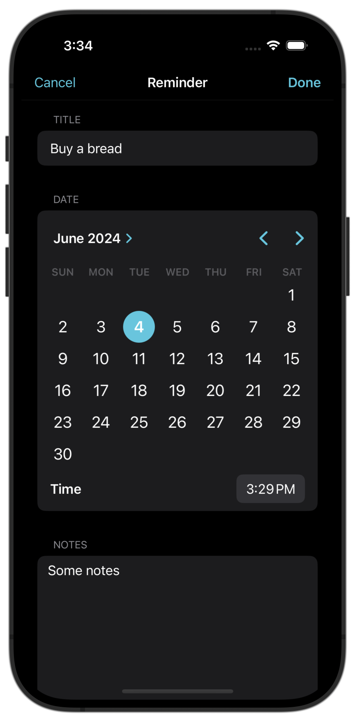
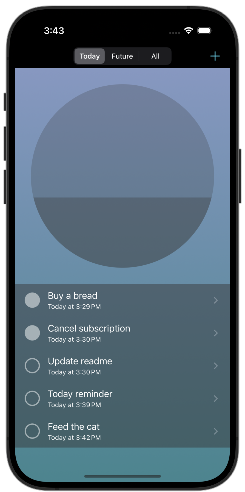
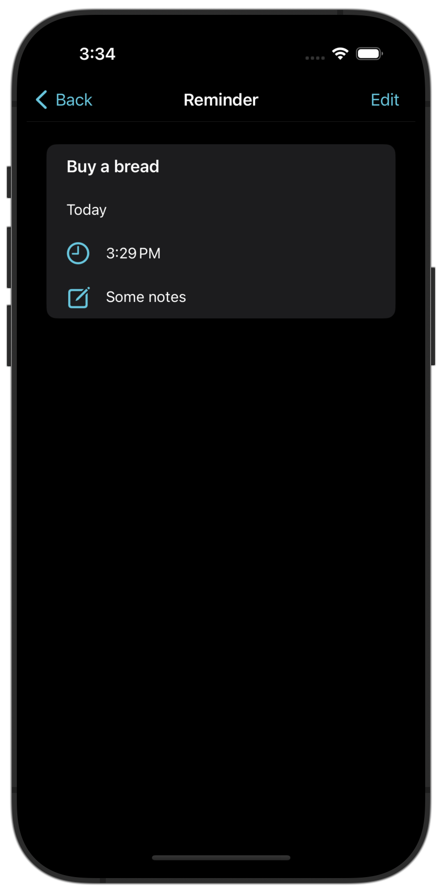

#  Today

Reminders app based on UIKit.

## Screens
| Editing Mode | Main screen | Reminder info |
| ----------- | ------------ | ------------- |
 |  | 

## User flow

## Features
* UIKit 
* EventKit
* Fully synchronized with Apple's Reminders app
* Reminder view and editing modes
* Reusable views
* Custom animations
* Segmented control
